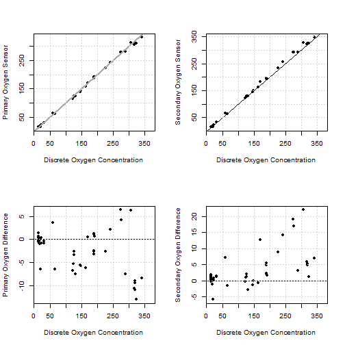

## Sensor vs. Winkler Comparisons

This is an R Markdown document. Markdown is a simple formatting syntax for authoring HTML, PDF, and MS Word documents. For more details on using R Markdown see <http://rmarkdown.rstudio.com>.

When you click the **Knit** button a document will be generated that includes both content as well as the output of any embedded R code chunks within the document. You can embed an R code chunk like this:


```r
par(mfrow = c(2,2))
plot(o2$Oxygen, o2$downcast1, pch = 16, xlab = 'Discrete Oxygen Concentration', ylab = 'Primary Oxygen Sensor')
abline(a = 0, b = 1, col = 'darkgrey', lwd = 2)
grid(); box()

plot(o2$Oxygen, o2$downcast2, pch = 16, xlab = 'Discrete Oxygen Concentration', ylab = 'Secondary Oxygen Sensor')
abline(a = 0, b = 1)
grid(); box()


plot(o2$Oxygen, o2$downcast1 - o2$Oxygen, pch = 16, xlab = 'Discrete Oxygen Concentration', ylab = 'Primary Oxygen Difference')
abline(h = 0)
grid(); box()

plot(o2$Oxygen, o2$downcast2 - o2$Oxygen, pch = 16, xlab = 'Discrete Oxygen Concentration', ylab = 'Secondary Oxygen Difference')
abline(h = 0)
grid(); box()
```



## Including Plots

You can also embed plots, for example:


Note that the `echo = FALSE` parameter was added to the code chunk to prevent printing of the R code that generated the plot.
